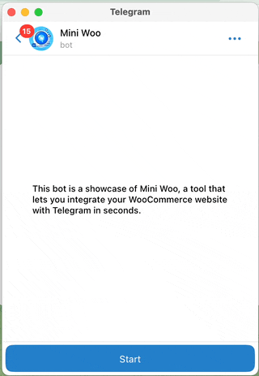

# Mini Woo: A Telegram Mini App for WooCommerce

Mini Woo is a project that allows you to create a [mini app](https://core.telegram.org/bots/webapps) for [Telegram](https://telegram.org/), the messaging app with over 500 million active users, that connects to your [WooCommerce](https://woocommerce.com/) website, the most popular e-commerce platform on the web. 



It uses [Next.js](https://nextjs.org/), a React framework for building fast and scalable web applications, and the Telegram [Bot API](https://core.telegram.org/bots/api) and the WooCommerce [REST API](https://woocommerce.github.io/woocommerce-rest-api-docs/) to provide a seamless shopping experience for your customers on Telegram. 

You can use this project as a template to customize your mini app with your own branding, products, and features, or modify the API to connect any other online store that supports RESTful web services. This project is open source and free to use. You can find the source code, documentation, and installation instructions [here on GitHub](https://github.com/mini-woo/mini-woo).

## Requirements

- Telegram Bot
- WooCommerce Website
- NodeJs (Latest LTS version recommended)


## Getting Started

1. Prepare Environment Variables
2. Deploy
3. Init Telegram Bot API Webhook

### Environment Variables

To use this project, you need to set the following environment variables:

- `NEXT_PUBLIC_BASE_PATH`
  This is the base URL of your deployment. For example, if you are deploying on Vercel, it can be something like `https://mini-woo-<your-username>.vercel.app`.


- `TELEGRAM_BOT_TOKEN`
  This is the access token that you get from [@BotFather](https://t.me/BotFather) when you create your Telegram bot.
- `TELEGRAM_BOT_SECRET`
  This is a password that you set to secure your APIs. It can be any string, such as `my-pass` or a randomly generated hash. Please make sure to keep it secret.
- `TELEGRAM_PAYMENT_PROVIDER_TOKEN`
  This is telegram payment provider token. You can connect payment methods from BotFather. [Payment Providers](https://core.telegram.org/bots/payments#supported-payment-providers), [Supported Currencies](https://core.telegram.org/bots/payments#supported-currencies)


- `WOOCOMMERCE_URL`
  This is the URL of your WooCommerce website. For example, `https://<your-super-cool-store>.com`.
- `WOOCOMMERCE_CONSUMER_KEY` `WOOCOMMERCE_CONSUMER_SECRET`
  These are the authentication key and secret that you obtain from WooCommerce settings. You can follow this [instruction](https://woocommerce.github.io/woocommerce-rest-api-docs/?shell#rest-api-keys) to generate them.

### Deploy

You need to deploy your app on a platform or a server of your choice.

#### Deploy on Vercel

The easiest way to deploy your Next.js app is to use the [Vercel Platform](https://vercel.com/new?utm_medium=default-template&filter=next.js&utm_source=create-next-app&utm_campaign=create-next-app-readme) from the creators of Next.js.
You need to fork this repository first.

Check out [Next.js deployment documentation](https://nextjs.org/docs/deployment) for more details.

#### Deploy on Server

If you prefer to deploy your app on your own server, you need to copy `example.env` to `.env `in the root of the project and fill the variables. Then, you need to run the following commands:

```bash
npm run build

npm run start
```
This will build and start your app on the port specified by the `PORT` variable in `.env`.

#### Run Locally for Development

Set environment variables then run:

```bash
npm run dev
```

you can use https://ngrok.com/

### Init Telegram Bot API Webhook

This is the last step! You need to set up a webhook for your Telegram bot to receive updates from Telegram. To do this, you just need to make a POST request to the following URL:

```bash
curl -X POST https://<your-deployment-url>/api/telegram-hook/init?secret_hash=<the-secret-password-from-env-var>
```

Replace `<your-deployment-url>` with the base URL of your deployment and `<the-secret-password-from-env-var>` with the value of `TELEGRAM_BOT_SECRET` in your environment variables or `.env`.

Now your mini app is ready! You can test it by sending commands or messages to your Telegram bot. Enjoy! 😊

## Features

- [x] Show products list
- [x] Filter by category
- [x] Register Order
- [x] Pay with telegram payment
- [ ] Support variable items
- [ ] Support search items
- [ ] Support shipping methods
- [ ] Support other payment methods
- [ ] more...

## Learn More

To learn more, take a look at the following resources:

- [Telegram Mini App](https://core.telegram.org/bots/webapps) - Starting point to learn about telegram web apps.
- [Telegram Bot API](https://core.telegram.org/bots/api) - Telegram Bot API full documentation.
- [Telegraf.js](https://telegraf.js.org/index.html) - Modern Telegram Bot API framework for Node.js (documents).
- [WooCommerce API](https://woocommerce.github.io/woocommerce-rest-api-docs) - WooCommerce REST api documentation.
- [Next.js Documentation](https://nextjs.org/docs) - learn about Next.js features and API.
- [Learn Next.js](https://nextjs.org/learn) - an interactive Next.js tutorial.

Your feedback and contributions are welcome!

